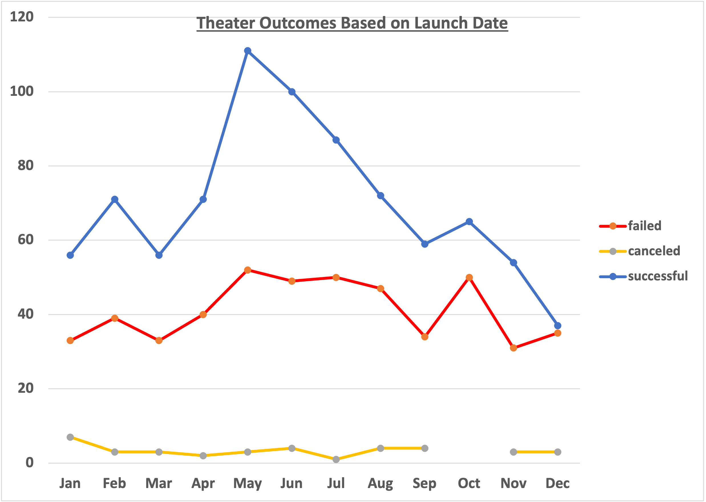
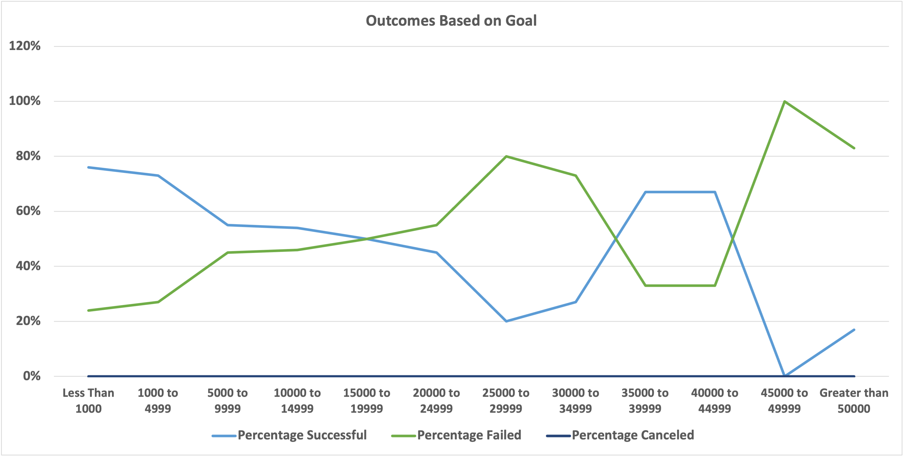

# Kickstarter_Analysis_Challenge

## Overview of Project

Our client, Louise, would like to understand more details on Kickstarter campaigns and would like to leverage our prior analysis on Kickstarter campaigns and gain insight for her play campaign.  The goal of this project is to examine theater Kickstarter campaigns and their launch dates to determine if there is a preference better time to launch a successful campaign.  In addition, an examination of the play outcomes relative to goals will be analyzed as well.  

### Purpose
  The focus of this analysis is to examine the Kickstarter dataset for theater campaigns.  The analysis will hopefully determine trends or relationships on the success of failure of a theater campaign based on the timing of its launch and/or play fundraising goals.  Understanding when is the best time to launch a successful campaign and setting a goal expectation to lead to the highest chance of a successful outcome.

### Analysis of Outcomes based on Launch Date
  This work was performed using an Excel analysis.  The workbook is located here [Kickstarter_Challenge](Kickstarter_Challenge.xlsx) and are available for review.  The worksheet Theater Outcomes by Launch data in the referenced workbook, contains a pivot table of filtered Kickstarter campaigns.  The launch date was converted into a date from it's sourced UNIX time format.  A years column was created using the years function was extracted on this converted date.   The pivot table uses the years and Parent Category from the Kickstarter sheet.  The filter is set to only look at the theater campaigns.  The rows are the months and the columns in the table reflect the number of outcomes of only the successful, failed, and canceled theater campaigns.  Live campaigns were not shown as their outcomes are unknown.   This data is then used to create a chart of the campaign outcomes vs the month the campaigns were launched.  This chart is located below in Figure 1.

Figure 1

### Analysis of Outcomes based on Goals

  This work was performed using an Excel analysis.  The workbook is located here [Kickstarter_Challenge](Kickstarter_Challenge.xlsx) and are available for review.  The worksheet Outcomes based on Goals data in the referenced workbook, contains a table of filtered Kickstarter campaigns.  Goals were split into 12 different provided fundraising target categories listed below:
  
  1)less than 1000
  2)1000 to 4999
  3)5000 to 9999
  4)10000 to 14999
  5)15000 to 19999
  6)20000 to 24999
  7)25000 to 29999
  8)30000 to 34999
  9)35000 to 39999
  10)40000 to 44999
  11)45000 to 49999
  12)greater than 50000

  Utilizing Excel's countifs function, the subcategories of plays were counted based on their success, failure, and canceled designation for each of the fundraising goals listed above.  The total sum of the projects in each goal range were summed and then percentages for the successful, failed, and canceled outcomes were calculated.  Please refer to the worksheet for the individual numbers.  A line chart was made with the lines for each of the successful, failed and canceled campaign outcomes with percentage on the y axis and goals values on the x axis.  This is provided in Figure 2 below.

Figure 2

### Challenges and Difficulties encountered

Some of the challenges with this dataset are the multiple categories and subcategories.  A need to be careful and check settings to make sure filter were being appropriately applied.  Additionally there were 4 play campaigns whose goals were exactly $50,000 which were not captured in the analysis due to the provided ranges excluding that single value in the goal bins.   The syntax on the countifs function can be a bit tricky when going through goal ranges.  It would have been easier to have a second column refer to the goal hi and low ranges.   

### Results

In analyzing the theater outcomes vs launch date in Figure 1 above, three things appear to be apparent.
  1. Late Spring and Early summer months of May, June, and July have the highest amount of successful theater campaigns, with May being the best month.  
  2. The total number of failed campaigns per month don't change significantly.  There is an small increase in the summer months and October.  The total number of        the campaigns increases so the failure rate may actually not increase.
  3. The number of canceled outcomes stay fairly constant.

In reviewing the Outcomes based on Goals chart in Figure 2 above a couple of comclusions can be drawn.
  1) Lower goals less than $5000 have a higher chance of success.
  2) Goals greater than $5000 have equal chances of success or failure.  Above $25000 the outcomes become more erratic.

  Based on the data, the best chance for a successful theater campaigns is launching in May.  Plays should have target goals of less than $5000 for the best chance of success.  Increasing the goal above this tend to result in a coin flip type outcome.

#### Limitations and additional work

  There are some limitations with this data.  The percentage chart on the outcomes based  on goals, does not reflect the lack of statistically needed samples in the individual bins.  With values greater than $25000 having less than 30 samples can lead to a misinterpretation of the data suggesting for instance that $35000 to $44999 might be more successful.  However, this uptick in figure two is due to the lack of samples in this range and one successful campaign can have a huge impact on the graph.  In addition, while the first part of the analysis examined the theater category, the second focused in on just the subcategory of the plays.  It might be better to filter the dataset on launch date to include only plays as the client is interested in plays and the theater category may contain less valid data.  It would also be good to look at the statistics surrounding the data to see where outliers may be affecting the analysis as well as understadning if outcomes are statistically valid.  Geography is also excluded and may need to be examined for area specific trends.
  
  Future work should include tables with the statistical trend of the distributions.  Graphs including total could and maybe binning the evelated goal data to include a larger population would be helpful.  Filtering for just plays across the clients geopgraphic area may also help identify trends.
  
